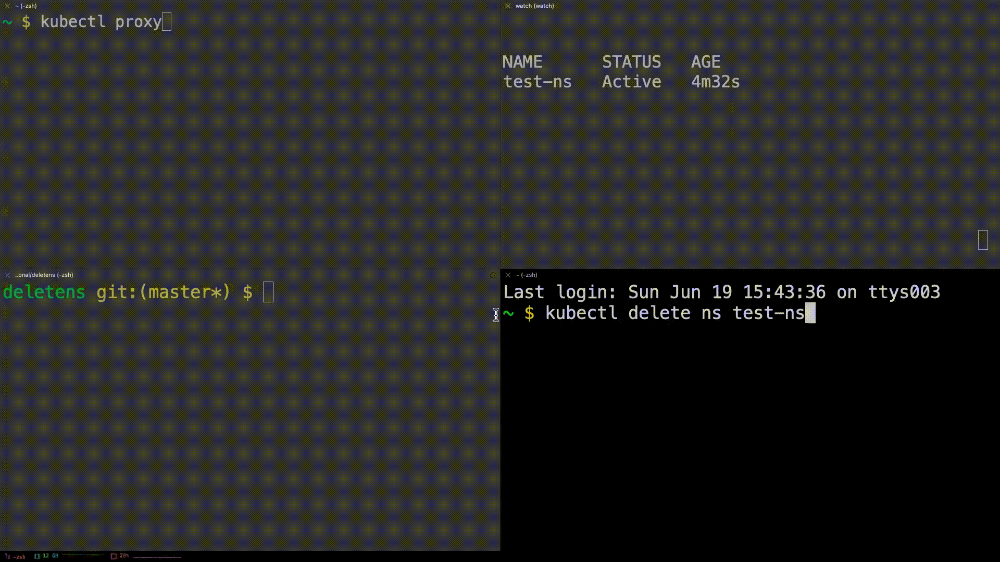

# delete-ns

Delete namespaces that include finalizers in `.metadata.finalizers` or `.spec.finalizers`.

> **Do not** use it in any real/production environment. It has just been developed to resolve some issues during local development.

## Requirements

```bash
kubectl
jq
curl
```

Also, please open your k8s api proxy as follows:
```bash
kubectl proxy
```

For more details about HTTP proxy of k8s API, please visit [official Kubernetes doc](https://kubernetes.io/docs/tasks/extend-kubernetes/http-proxy-access-api/).

## Usage



```
FLAGS

-n <namespace>: namespace to be deleted, required.
-p <PORT>: k8s proxy port, default 8001.
-a <address>: k8s proxy address, default 127.0.0.1.
```

```bash
sh deletens.sh -n <your_namespace>
```
